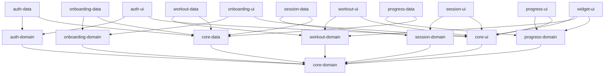
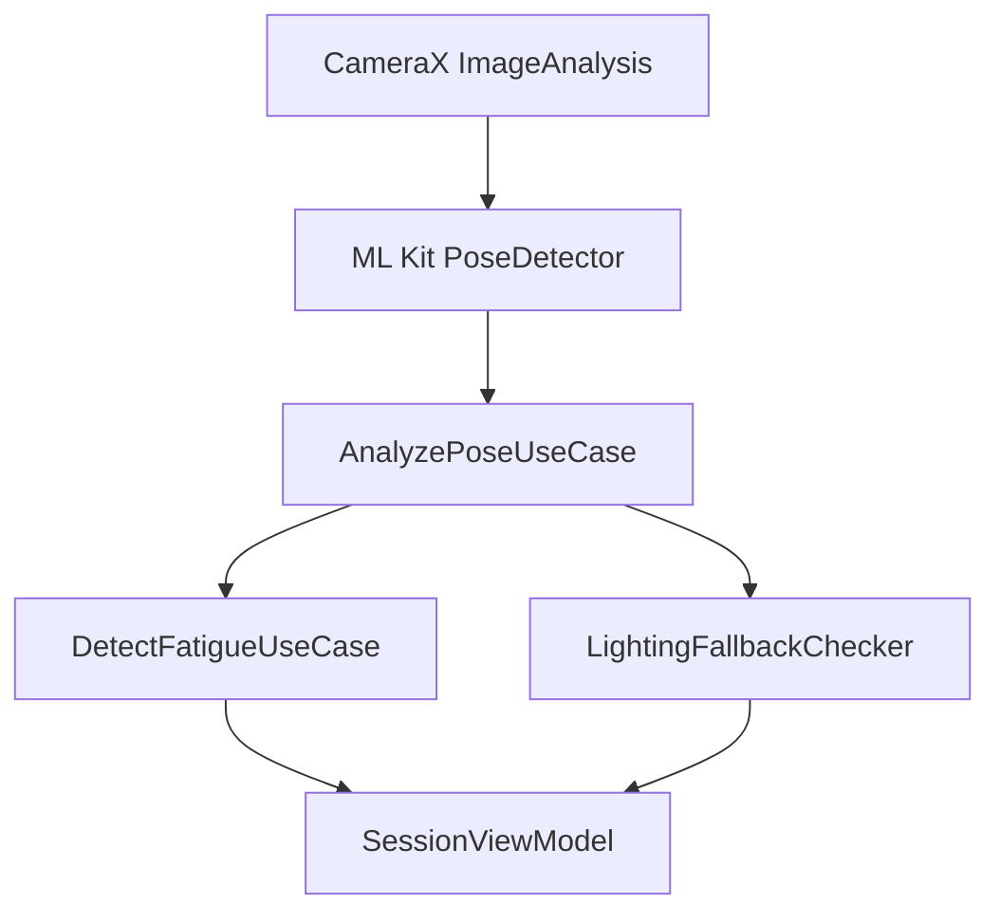
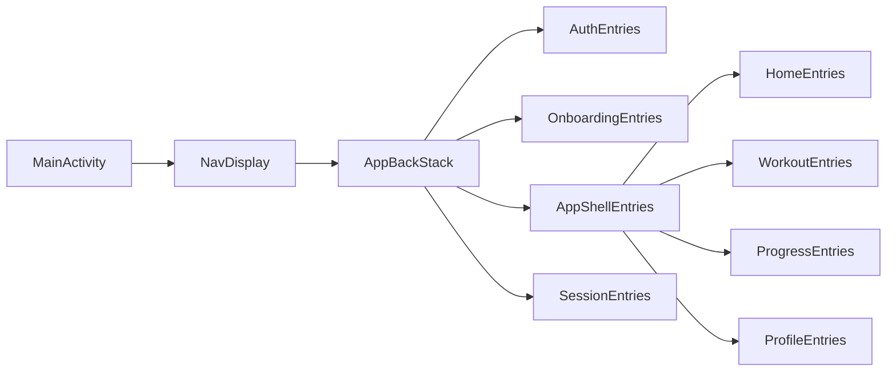

# FitLife – Architecture Document (v1.2)

---

## Change Log

- v1.2 - 2026-06-14 - Migrated the navigation architecture from Navigation Compose 2 to Navigation 3 with typed keys, app-owned back stacks, `NavDisplay`, and entry-scoped ViewModels.

- v1.1 — 2026-05-31 — Added widget module, confirmed v1.0 scope additions, fixed lighting fallback debounce rules, and added Section 14 Data Model Appendix.

## 1. Module Structure & Gradle Dependency Graph

**Gradle Settings (`settings.gradle.kts`):**
```kotlin
include(":app")
include(":core:core-data")
include(":core:core-domain")
include(":core:core-ui")

include(":feature:auth:auth-data")
include(":feature:auth:auth-domain")
include(":feature:auth:auth-ui")

include(":feature:onboarding:onboarding-data")
include(":feature:onboarding:onboarding-domain")
include(":feature:onboarding:onboarding-ui")

include(":feature:workout:workout-data")
include(":feature:workout:workout-domain")
include(":feature:workout:workout-ui")

include(":feature:session:session-data")
include(":feature:session:session-domain")
include(":feature:session:session-ui")

include(":feature:progress:progress-data")
include(":feature:progress:progress-domain")
include(":feature:progress:progress-ui")

include(":feature:widget:widget-ui")
```

**Dependency Graph (Mermaid):**


*All **core-*** modules are independent of feature modules. Feature modules depend only on core modules and their own sibling layers. The `:feature:widget:widget-ui` module is UI-only and hosts the Jetpack Glance 2x2 widget for v1.0.*

---

## 2. MVI Implementation Example (Workout Feature)

### State
```kotlin
data class WorkoutState(
    val plan: WorkoutPlan? = null,
    val isLoading: Boolean = false,
    val errorMessage: String? = null
) : UIState
```

### Event
```kotlin
sealed class WorkoutEvent : Event {
    data class LoadPlan(val profile: UserProfile) : WorkoutEvent()
    object Refresh : WorkoutEvent()
}
```

### One‑Time Action
```kotlin
sealed class WorkoutAction : OneTimeAction {
    data class ShowError(val message: String) : WorkoutAction()
    data class NavigateToSession(val planId: String) : WorkoutAction()
}
```

### ViewModel
```kotlin
@HiltViewModel
class WorkoutViewModel @Inject constructor(
    private val generatePlanUseCase: GenerateWorkoutPlanUseCase
) : MVIBaseViewModel<WorkoutState, WorkoutEvent, WorkoutAction>() {

    override fun createInitialState() = WorkoutState()

    override fun onEvent(event: WorkoutEvent) {
        when (event) {
            is WorkoutEvent.LoadPlan -> fetchPlan(event.profile)
            WorkoutEvent.Refresh -> state.value.plan?.let { fetchPlan(it.profile) }
        }
    }

    private fun fetchPlan(profile: UserProfile) {
        setState { copy(isLoading = true, errorMessage = null) }
        viewModelScope.launch {
            when (val result = generatePlanUseCase(profile)) {
                is Result.Success -> setState { copy(plan = result.data, isLoading = false) }
                is Result.Error -> {
                    setState { copy(isLoading = false) }
                    sendAction(WorkoutAction.ShowError(result.error::class.simpleName ?: "Error"))
                }
            }
        }
    }
}
```

### Compose Screen (collecting state)
```kotlin
@Composable
fun WorkoutScreen(viewModel: WorkoutViewModel = hiltViewModel()) {
    val state by viewModel.state.collectAsState()
    LaunchedEffect(Unit) {
        viewModel.action.collect { action ->
            when (action) {
                is WorkoutAction.ShowError -> {
                    // show snackbar with action.message
                }
                is WorkoutAction.NavigateToSession ->
                    onNavigateToSession(SessionKey(action.planId))
            }
        }
    }

    // UI rendering based on `state`
    // Handle one‑time actions (e.g., Snackbar) when `action` changes
}
```

---

## 3. Room Database Schema

| Entity | Table Name | Primary Key | Columns (type) |
|--------|------------|-------------|----------------|
| User | users | userId (String) | name, email, age, fitnessLevel, createdAt |
| WorkoutPlan | workout_plans | planId (String) | userId (FK), level, location, jsonPayload |
| Session | sessions | sessionId (String) | userId (FK), planId (FK), startTime, endTime, fatigueFlag |
| Exercise | exercises | exerciseId (String) | name, description, videoUrl |
| SessionExerciseCrossRef | session_exercise_cross_ref | composite (sessionId, exerciseId) | orderIdx, reps, sets |

**DAO Examples**
```kotlin
@Dao
interface WorkoutPlanDao {
    @Insert(onConflict = OnConflictStrategy.REPLACE)
    suspend fun insert(plan: WorkoutPlanEntity)

    @Query("SELECT * FROM workout_plans WHERE userId = :userId ORDER BY createdAt DESC LIMIT 1")
    suspend fun getLatestPlan(userId: String): WorkoutPlanEntity?
}
```

---

## 4. Firestore Collections Structure & Sync Strategy

- **Root collection:** `users/{userId}`
    - Sub‑collection `workoutPlans` → mirrors Room `workout_plans`
    - Sub‑collection `sessions` → mirrors Room `sessions`
    - Document fields: same as Room columns (JSON compatible)

**Sync Strategy**
1. Write to Room first (source of truth).
2. Use a `WorkManager`‑backed sync worker that watches Room changes via `Flow`.
3. When online, the worker uploads/updates the corresponding Firestore document.
4. Conflict resolution: latest‑timestamp wins; server timestamps are stored for reconciliation.

---

## 5. Repository Interfaces (Domain Layer)

```kotlin
interface IAuthRepository : IBaseRepository {
    suspend fun signIn(email: String, password: String): Result<User, NetworkErrors>
    suspend fun signInWithGoogle(token: String): Result<User, NetworkErrors>
    suspend fun signOut(): Result<Unit, NetworkErrors>
    suspend fun getCurrentUser(): Result<User?, NetworkErrors>
}
```

```kotlin
interface IWorkoutRepository : IBaseRepository {
    suspend fun generatePlan(profile: UserProfile): Result<WorkoutPlan, NetworkErrors>
    suspend fun getCachedPlan(userId: String): Result<WorkoutPlan?, NetworkErrors>
    suspend fun savePlan(plan: WorkoutPlan): Result<Unit, NetworkErrors>
}
```

Similarly for `ISessionRepository`, `IProgressRepository`, `IOnboardingRepository` – each returning `Result` wrapped types.

---

## 6. Use‑Case Implementations (Domain)

### Example: GenerateWorkoutPlanUseCase
```kotlin
class GenerateWorkoutPlanUseCase @Inject constructor(
    private val repository: IWorkoutRepository,
    private val fallbackAssetProvider: AssetProvider // reads assets/fallback_workout_plans.json
) {
    suspend operator fun invoke(profile: UserProfile): Result<WorkoutPlan, NetworkErrors> {
        // 1️⃣ Try Gemini API via repository (which itself calls safeCall etc.)
        return when (val apiResult = repository.generatePlan(profile)) {
            is Result.Success -> apiResult
            is Result.Error -> {
                // 2️⃣ If API fails or latency >5s, load local fallback
                val fallback = fallbackAssetProvider.loadFallbackPlan(profile.fitnessLevel, profile.location)
                fallback?.let { Result.Success(it) }
                    ?: Result.Error(NetworkErrors.UnknownApiError)
            }
        }
    }
}
```

Other use‑cases follow the same **single‑operator‑fun `invoke()`** pattern and depend only on repository interfaces.

---

## 7. ML Kit Pose Detection Pipeline



**Key steps:**
1. `CameraX` provides `ImageProxy` frames.
2. `PoseDetector.process(image)` returns `Pose` (on‑device).
3. `AnalyzePoseUseCase` extracts joint angles, builds a `PoseData` object.
4. `DetectFatigueUseCase` compares current rep angles against baseline (first two reps) and flags fatigue when deviation > threshold for ≥3 consecutive reps.
5. `LightingFallbackChecker` evaluates `pose.confidence` (< 0.6) and ambient light sensor (or frame brightness). 2 seconds of sustained low confidence or brightness < 10 lux triggers audio-only mode. 3 seconds of stable brightness > 10 lux and pose confidence > 0.6 is required before reverting to visual mode.

---

## 8. Fatigue Detection Algorithm

1. **Baseline collection:** First two reps – compute average joint angles (`baselineAngles`).  
2. **Per‑rep analysis:** For each subsequent rep, compute `delta = |currentAngles - baselineAngles|` per joint.
3. **Threshold:** If > 15° on any major joint **and** this occurs for three consecutive reps → `fatigueDetected = true`.
4. **Action:** Emit `FatigueEvent` through the MVI `OneTimeAction` channel; UI shows warning and logs to analytics.

---

## 9. Lighting Detection Trigger

- **Confidence check:** `pose.confidence < 0.6`.
- **Ambient light:** Compute average pixel brightness; if `< 10 lux`.
- **Trigger debounce:** 2 seconds of sustained low confidence or brightness < 10 lux triggers audio-only mode.
- **Revert debounce:** 3 seconds of stable brightness > 10 lux and pose confidence > 0.6 required before reverting to visual mode.
- **User override:** Bottom‑sheet toggle in UI that forces audio mode or restores visual mode.

---

## 9.1 Confirmed v1.0 Scope Additions

- **WhatsApp badge sharing:** Implemented from the post-session summary with a generated share image card and Android share sheet. Analytics logs `whatsapp_share_tapped`.
- **Smart reminders:** Implemented with WorkManager from the `:app` module, using adaptive timing based on the user's historical workout times and profile notification preferences.
- **Home screen widget:** Implemented with Jetpack Glance in `:feature:widget:widget-ui`; 2x2 widget shows today's workout and current streak.
- **Dynamic equipment rerouting:** Implemented in session flow with a one-tap unavailable action, Gemini alternatives, and local fallback alternatives if Gemini is unavailable.

---

## 10. Gemini API Integration Flow

1. **Prepare prompt** – JSON template with fields `{age, weight, goals, level, location}`.
2. **Call Gemini API** via Retrofit service (`GeminiApiService.generatePlan(request)`).
3. **Timeout handling:** Use `withTimeout(5000)`; if exceeds, treat as failure.
4. **Response parsing:** Gson → `GeminiPlanResponse` → map to domain `WorkoutPlan`.
5. **Caching:** Before API call, `Room` is queried for a cached plan for the same profile; if found and < 24 h old, return it.
6. **Fallback:** On API failure or latency > 5 s, load local JSON asset `assets/fallback_workout_plans.json` (see Q2) and select matching plan.
7. **Retry:** Exponential back‑off (1 s, 2 s, 4 s) up to 3 attempts, then fallback.

---

## 11. Navigation 3 Structure

- **Single Activity (`MainActivity`)** hosts a Navigation 3 `NavDisplay`.
- The composition root owns navigation state through saveable `NavBackStack<NavKey>` instances.
- Every destination is represented by a strongly typed, `@Serializable` key implementing `NavKey`; string routes are not used.
- `NavDisplay` resolves keys through an `entryProvider`.
- `rememberSaveableStateHolderNavEntryDecorator()` and `rememberViewModelStoreNavEntryDecorator()` preserve destination state and scope ViewModels to individual back-stack entries.
- Splash, authentication, sign-out, and onboarding completion use atomic root replacement so protected transitions cannot return to obsolete destinations.
- Feature UI modules own their navigation keys and entry-provider registration helpers. They expose navigation callbacks or MVI actions and do not receive a `NavController`.
- The initial AUTH-000/AUTH-001 flow uses one app-owned stack. When bottom navigation is implemented, the App Shell hosts the Home, Workout, Progress, and Profile tabs, each retaining an independent top-level back stack. Session remains a nested flow reachable from the tab content that launches it.
- Incoming deep links are parsed at the app boundary and translated into typed keys. Planned links include plan sharing (`app://fitlife/plan/{planId}`) and session resume.



Navigation dependencies are centralized in `gradle/libs.versions.toml`: Navigation 3 runtime/UI `1.1.2`, Lifecycle Navigation 3 integration aligned to Lifecycle `2.10.0`, and Kotlin serialization aligned to Kotlin `2.2.10`.

---

## 12. Week 1 Technical Spikes

| Spike | Goal | Pass Criteria | Fail Action |
|-------|------|----------------|------------|
| **Spike 1 – ML Kit performance** | Verify ≥ 15 fps pose detection on Snapdragon 6xx | ≥ 15 fps in good lighting for 5 min continuous run | Defer pose detection to v1.1, launch with audio‑only guidance |
| **Spike 2 – Gemini API latency** | Confirm < 5 s plan generation on free tier | Average < 5 s over 10 calls, 95 % success | Implement static fallback templates as primary source |
| **Spike 3 – Room + Firestore sync** | Validate offline‑first pattern (Room write → Firestore sync) | Data persists offline, syncs when network restored, no conflicts | Use Firestore only (no offline) and note in scope |

---

## 13. Open Questions (Answered)

| Question | Answer |
|----------|--------|
| Gradle module versioning | Flat module names as listed in **Q1**. |
| Gemini API fallback format | Local JSON asset `assets/fallback_workout_plans.json` (see **Q2**). |
| Pose confidence threshold | 0.6; 2 seconds sustained low confidence or brightness < 10 lux triggers audio-only mode; 3 seconds stable brightness > 10 lux and confidence > 0.6 reverts to visual mode (**Q3**). |
| Background worker for fatigue detection | Handled via coroutine in Session ViewModel (**Q4**). |
| Hilt module naming | Use `CoreDataModule`, `NetworkModule`, `AuthModule`, `WorkoutModule`, `SessionModule`, `OnboardingModule`, `ProgressModule` (**Q5**). |

---

## 14. Data Model Appendix

### 14.1 User Profile (Room Entity)

```kotlin
data class UserEntity(
    val userId: String,           // Firebase UID
    val name: String,
    val email: String,
    val age: Int,
    val fitnessLevel: FitnessLevel, // BEGINNER, INTERMEDIATE
    val goals: List<FitnessGoal>,   // stored as JSON string
    val equipment: List<Equipment>, // stored as JSON string
    val weeklyFrequency: Int,       // workouts per week
    val currentSplit: String?,      // intermediate only
    val oneRepMax: Map<String, Float>?, // intermediate only
    val createdAt: Long,
    val updatedAt: Long
)

enum class FitnessLevel { BEGINNER, INTERMEDIATE }
enum class FitnessGoal { WEIGHT_LOSS, STRENGTH, GENERAL_HEALTH }
enum class Equipment {
    NONE, RESISTANCE_BANDS, DUMBBELLS, FULL_GYM
}
```

### 14.2 Workout Plan (Room Entity)

```kotlin
data class WorkoutPlanEntity(
    val planId: String,
    val userId: String,
    val generatedAt: Long,
    val expiresAt: Long,        // createdAt + 24 hours
    val fitnessLevel: FitnessLevel,
    val location: WorkoutLocation, // HOME, GYM, OUTDOOR
    val planJson: String,       // full Gemini response JSON
    val isFallback: Boolean,    // true if from asset file
    val weekNumber: Int
)

enum class WorkoutLocation { HOME, GYM, OUTDOOR }
```

### 14.3 Workout Day (Parsed From planJson)

```kotlin
data class WorkoutDayEntity(
    val dayId: String,
    val planId: String,
    val dayNumber: Int,         // 1-7
    val isRestDay: Boolean,
    val focusMuscles: String,   // e.g. "Chest, Triceps"
    val exercises: List<ExerciseEntity> // nested JSON
)
```

### 14.4 Exercise Library (Room Entity)

```kotlin
data class ExerciseEntity(
    val exerciseId: String,
    val name: String,
    val description: String,
    val muscleGroups: List<String>, // JSON
    val difficulty: ExerciseDifficulty,
    val equipmentRequired: Equipment,
    val lottieAssetPath: String?,   // path in assets/
    val defaultSets: Int,
    val defaultReps: Int,
    val defaultDurationSecs: Int?,  // for timed exercises
    val formCues: List<String>,     // audio cue text list
    val poseExerciseType: PoseExerciseType? // null = no pose
)

enum class ExerciseDifficulty { BEGINNER, INTERMEDIATE, ADVANCED }
enum class PoseExerciseType {
    SQUAT, PUSH_UP, LUNGE, PLANK, SHOULDER_PRESS
    // v1.0 supports 5 pose types only
}
```

**Exercise library seed:** Room is pre-populated from `assets/exercises.json` with a minimum of 30 exercises.

| # | Exercise | Equipment Group | Pose Type |
| --- | --- | --- | --- |
| 1 | Push-Up | Bodyweight | PUSH_UP |
| 2 | Squat | Bodyweight | SQUAT |
| 3 | Lunge | Bodyweight | LUNGE |
| 4 | Plank | Bodyweight | PLANK |
| 5 | Mountain Climber | Bodyweight | None |
| 6 | Burpee | Bodyweight | None |
| 7 | Jump Squat | Bodyweight | None |
| 8 | Glute Bridge | Bodyweight | None |
| 9 | Superman | Bodyweight | None |
| 10 | Tricep Dip (chair) | Bodyweight | None |
| 11 | Jumping Jacks | Bodyweight | None |
| 12 | High Knees | Bodyweight | None |
| 13 | Donkey Kick | Bodyweight | None |
| 14 | Fire Hydrant | Bodyweight | None |
| 15 | Bicycle Crunch | Bodyweight | None |
| 16 | Banded Row | Resistance Band | None |
| 17 | Banded Chest Press | Resistance Band | None |
| 18 | Banded Lateral Walk | Resistance Band | None |
| 19 | Banded Bicep Curl | Resistance Band | None |
| 20 | Banded Shoulder Press | Resistance Band | SHOULDER_PRESS |
| 21 | Barbell Squat | Gym | SQUAT |
| 22 | Bench Press | Gym | None |
| 23 | Deadlift | Gym | None |
| 24 | Dumbbell Lunge | Gym | LUNGE |
| 25 | Lat Pulldown | Gym | None |
| 26 | Seated Row | Gym | None |
| 27 | Dumbbell Shoulder Press | Gym | SHOULDER_PRESS |
| 28 | Leg Press | Gym | None |
| 29 | Cable Fly | Gym | None |
| 30 | Dumbbell Bicep Curl | Gym | None |

### 14.5 Session (Room Entity)

```kotlin
data class SessionEntity(
    val sessionId: String,
    val userId: String,
    val planId: String,
    val workoutDayId: String,
    val startTime: Long,
    val endTime: Long?,
    val durationSeconds: Int?,
    val totalReps: Int,
    val totalSets: Int,
    val fatigueEventCount: Int,
    val audioFallbackUsed: Boolean,
    val completionPercentage: Float, // 0.0 - 1.0
    val whatsAppShared: Boolean
)
```

### 14.6 Analytics Events Taxonomy

| Event | Parameters |
| --- | --- |
| `onboarding_started` | `level: String` |
| `onboarding_completed` | `level: String`, `duration_ms: Long` |
| `plan_generated` | `is_fallback: Boolean`, `level: String`, `location: String` |
| `session_started` | `plan_id: String`, `exercise_count: Int` |
| `session_completed` | `duration_secs: Int`, `total_reps: Int`, `fatigue_events: Int`, `audio_fallback_used: Boolean`, `completion_pct: Float` |
| `session_abandoned` | `reason: String`, `completion_pct: Float` |
| `fatigue_detected` | `exercise_name: String`, `rep_number: Int` |
| `fatigue_dismissed` | `exercise_name: String` |
| `lighting_fallback_triggered` | `confidence: Float` |
| `lighting_fallback_reverted` | `duration_secs: Int` |
| `equipment_rerouted` | `original: String`, `alternative: String` |
| `whatsapp_share_tapped` | `session_id: String` |
| `pose_feedback_rated` | `rating: Int`, `exercise: String` |

**Document generated automatically per user approval.**
